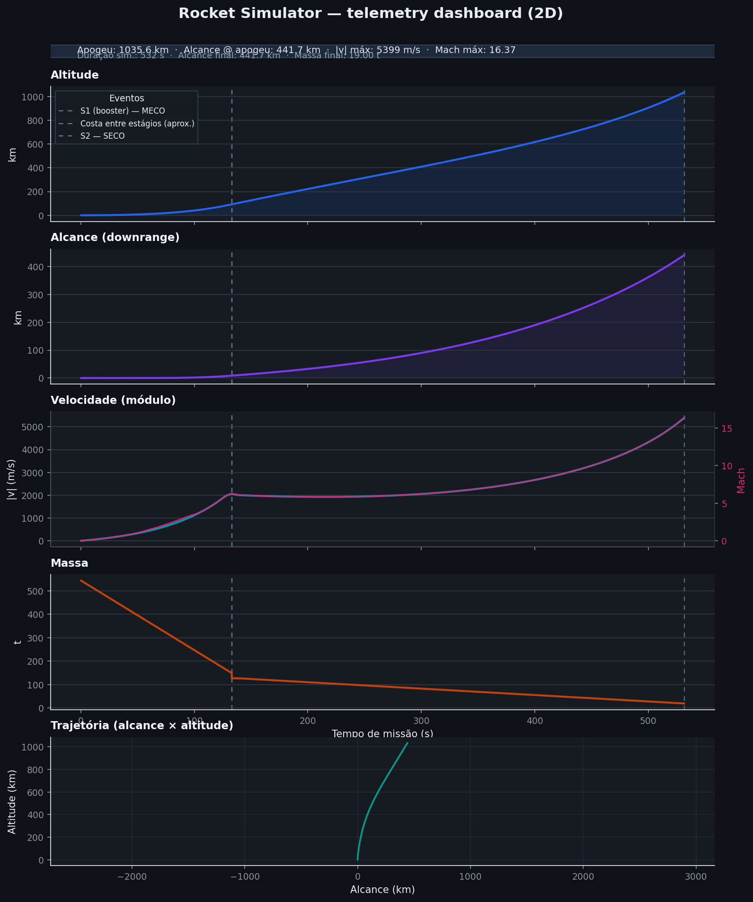

# Rocket Simulator

<p align="center">
  
</p>

<p align="center">
  <sub>Light theme (default). Dark theme preview: <code>assets/dashboard_preview_dark.png</code></sub>
</p>

---

**Multi-stage launch simulator with adaptive numerical integration (SciPy `RK45`)**, modeling **Mach-dependent aerodynamic drag**, **ISA atmospheric variation** (density, pressure, speed of sound), **time-varying thrust schedules** per stage with **sea-level / vacuum** blending, and a **pitch program** (scalar angle from vertical vs mission time) for **planar 2D** ascent (downrange × altitude).

This is an **engineering-style trajectory kernel**: forces are assembled from first principles; the integrator advances a coupled state \([x,\,y,\,v_x,\,v_y]\) with stage boundaries and optional coast segments (MECO → second-stage style).

**Disclaimer:** the bundled “Falcon 9-like” preset uses **public, order-of-magnitude** masses and thrusts for teaching — **not** official flight data. The model is **2D point-mass** (no orbit propagation, no 6DOF attitude).

---

## Screenshots & media

| Asset | Description |
|-------|-------------|
| `assets/dashboard_preview.png` | Full dashboard (altitude, range, \|v\| + Mach, mass, trajectory) — **versioned for README** |
| `assets/dashboard_preview_dark.png` | Same run, dark theme |
| GIF / video | Not stored in-repo (size). See [docs/VALIDATION.md](docs/VALIDATION.md#recording-a-gif-for-the-readme-optional) to capture a short loop. |

Regenerate previews after physics/UI changes:

```bash
python scripts/generate_docs_assets.py
```

---

## Features

- **ISA atmosphere** — density, pressure, **speed of sound** → Mach number.
- **Multi-stage** — sequential burn, dry-mass jettison, configurable **coast** between stages.
- **Thrust** — `LinearSchedule1D` **fraction vs stage time** × **SL/vac** thrust from local pressure.
- **Drag** — **Cd(Mach)** (tabulated, linearly interpolated); force opposite **v** in 2D.
- **Pitch** — mission-time schedule → degrees from vertical toward +x (`MissionParameters.pitch_schedule`).
- **Visualization** — multi-panel dashboard + **x–y** ground track; light/dark themes.
- **Export** — CSV telemetry + PNG/PDF/SVG (`simulation/export_results.py`).
- **Tests** — unit + mission plausibility checks (`pytest`).

---

## Validation & benchmarks

Automated checks, order-of-magnitude notes vs public launch timelines, and how to add your own overlays — see **[docs/VALIDATION.md](docs/VALIDATION.md)**.

Quick run:

```bash
python -m pytest tests -q
```

---

## Project layout

| Path | Contents |
|------|----------|
| `core/schedules.py` | Linear schedules (thrust, pitch) |
| `core/physics.py` | Gravity, 2D drag, SL/vac thrust, Cd(Mach) |
| `core/environment.py` | ISA, density, speed of sound |
| `core/rocket.py` | Stages, Falcon-like preset, `SimulationHistory` |
| `simulation/engine.py` | `run_mission`, `MissionParameters` |
| `simulation/integrator.py` | `solve_ivp` + auxiliary RK4 |
| `simulation/export_results.py` | CSV / figure export |
| `visualization/plot.py` | 2D dashboard |
| `scripts/generate_docs_assets.py` | Regenerate README images |
| `docs/VALIDATION.md` | Validation methodology & benchmarks |
| `api/` | Placeholder for HTTP API (not implemented) |
| `main.py` | CLI: run, theme, `--csv`, `--figure` |
| `tests/` | Automated tests |

---

## Requirements

- Python **3.10+** recommended  
- See `requirements.txt`: NumPy, SciPy, Matplotlib, Pytest

## Setup

```bash
python -m venv venv
```

**Windows (PowerShell):**

```powershell
.\venv\Scripts\Activate.ps1
pip install -r requirements.txt
```

**Linux / macOS:**

```bash
source venv/bin/activate
pip install -r requirements.txt
```

## Usage

```bash
python main.py
python main.py --theme dark
python main.py --csv out/telemetry.csv
python main.py --figure out/dashboard.png
python main.py --csv out/data.csv --figure out/dashboard.pdf --theme dark
```

Without `--csv` or `--figure`, the app opens the interactive dashboard. Figures are only written when `--figure` is set.

---

## Model limitations

- **Planar 2D** — no orbital mechanics, 3D body axis, or real GNC.
- **Thrust** aligned with scalar pitch (no yaw/side force).
- **Cd(Mach)** and reference area are generic — not wind-tunnel or flight-identified.

**Roadmap ideas:** HTTP API in `api/main.py`, 6DOF, thrust tables from CSV, optional GIF in `assets/` after capture.
